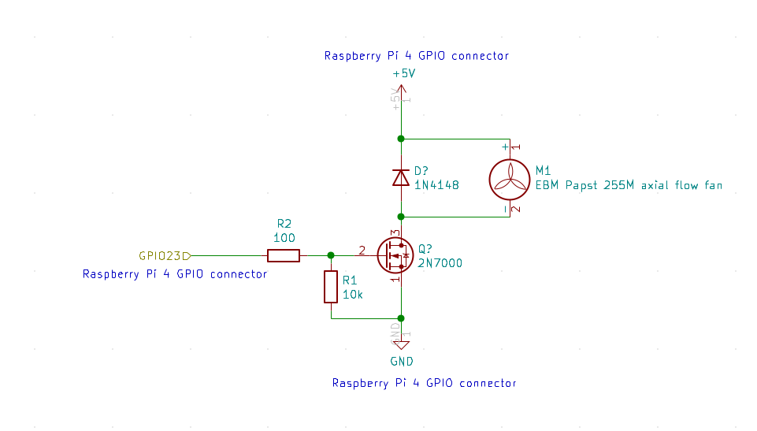

 # Libreelec fan control for a Raspberry Pi 4 + HifiBerry Amp2 shield  
 
 
 - ideal for video streaming
 - quiet
 - metal case
 - external WiFi antenna
 - temperature controlled PWM of fan
 - simple, only few additional hardware components are required
 

## hardware

- Raspberry Pi 4 4GByte with U.FL antenna connector e.g. from [geeks-r-us](https://geeks-r-us.de/produkt/raspberry-pi-4-mit-u-fl-buchse/)
- WLAN Upgrade Kit Raspberry Pi / ESP8266 5dBi e.g. from [geeks-r-us](https://geeks-r-us.de/produkt/wlan-upgrade-kit-raspberry-pi-esp8266/)
    - drill an additional 6.5 mm hole for the RP-SMA socket into the metal case next to the fan opening
- Hifiberry AMP2 shield e.g. from [Reichelt](https://www.reichelt.de/de/de/raspberry-pi-shield-hifiberry-amp2-rpi-hb-amp2-p214090.html)
- power supply LEICKE 72W Netzteil 12V 6A e.g. from [Amazon](https://www.amazon.de/kompatibel-HifiBerry-Bildschirmen-Monitoren-Festplatten/dp/B07FLZ1SGY)
- metal case for Raspberry Pi 4 & HiFiBerry AMP2, black e.g. from [Reichelt](https://www.reichelt.de/gehaeuse-fuer-raspberry-pi-4-hifiberry-amp2-sw-hb-case-amp2-p273772.html)
- very quiet 25mm fan with ball bearing EBM Papst 255M axial flow fan 5 V/DC 2.3 m³/h (L x B x H) 25 x 25 x 8 mm e.g. from [Conrad](https://www.conrad.de/de/p/ebm-papst-255m-axialluefter-5-v-dc-2-3-m-h-l-x-b-x-h-25-x-25-x-8-mm-1926271.html)
- heat sink 40 mm x 30 mm for Raspberry Pi 4 e.g. from [Reichelt](https://www.reichelt.de/raspberry-pi-4-kuehlkoerper-40-x-30-x-5-mm-schwarz-rpi-cool-40x30-p261928.html)
- spacers, screws as appropriate
- loudspeaker and speaker cables, e.g. Polk S10E
- TV or monitor, e.g. Philips Monitor BDM3270QP/00
- for the fan control
    - 2N 7000 FAI MOSFET, N-CH, 60V, 0,115A, 0,4W, TO-92 e.g. from [Reichelt](https://www.reichelt.de/mosfet-n-ch-60v-0-115a-0-4w-to-92-2n-7000-fai-p219076.html)
    - resistor 10kOhm e.g. from [Reichelt](https://www.reichelt.de/duennschichtwiderstand-axial-0-4-w-10-kohm-1--vi-mba02040c1002-p233622.html)
    - resistor 100Ohm e.g. from [Reichelt](https://www.reichelt.de/duennschichtwiderstand-axial-0-6-w-100-ohm-1--vi-mbb02070c1000-p233663.html)
    - diode 1N4148 e.g. from [Reichelt](https://www.reichelt.de/schalt-diode-100-v-150-ma-do-35-1n-4148-p1730.html)
    - schematics of fan control:

    + solder as floating wiring, ensure that all components are isolated by insulation tape 
    - as reference, the GPIO pinout of a Raspberry Pi 4 is available e.g. [here](https://maker.pro/raspberry-pi/tutorial/raspberry-pi-4-gpio-pinout)
    + used Raspberry Pi 4 GPIO pins:
        * +5V power (#2)
        * GND ground (#6)
        * BCM24 (#18)
        * note: do not use GPIOs that are used by the Hifiberry AMP2, see [here](https://www.hifiberry.com/docs/hardware/gpio-usage-of-hifiberry-boards/)

## software

- Libreelec Rpi4 nightly build e.g. [this one (may not exist anymore)](https://test.libreelec.tv/11.0/RPi/RPi4/LibreELEC-RPi4.arm-11.0-nightly-20230213-0b6ce71.img.gz) (worked for me, please check for the latest available RPi4 nightly builds at https://test.libreelec.tv/11.0/RPi/RPi4/: LibreELEC-RPi4.arm-11.0-nightly-*.img.gz)
- replace the Rapberry Pi 4's config.txt:
    + connect to the Raspberry Pi 4 via ssh:
        + enable ssh access in Libreelec
        > ssh root@<raspberry_pi4_ip_address>
        + the default ssh password is: libreelec (if not changed yet, it is strongly recommended to change the default password!)
        + the /flash boot partition is read-only by default, so we need to remount it in read-write mode:

        > mount -o remount,rw /flash
        + now execute the following commands at the command line
        > cd /flash
        >   
        > wget https://github.com/FUEL4EP/Libreelec_Raspberry_Pi4_Fan_Control/blob/master/config.txt
        + then set the /flash partition back to read-only mode:
        > mount -o remount,ro /flash
        + and reboot for the changes in config.txt to be applied:
        > reboot
- the fan control software is derived from [here](https://www.internauta37.altervista.org/en/blog/install-melopero-fan-hat-raspberry-pi-4-libreelec). Many thanks to [internauta37](https://www.internauta37.altervista.org/en) !
    - installation procedure for the fan control (derived from [here](https://www.internauta37.altervista.org/en/blog/install-melopero-fan-hat-raspberry-pi-4-libreelec).)
    - major change is that the fan is turning at 'turn_on_speed (default: 65%)' speed for 1 second after each change of the fan speed
    - to make the fan working on LibreELEC it is necessary to perform the following steps:

        + install the Addon Raspberry Pi Tools in LibreELEC

        + connect to the Raspberry Pi 4 via ssh:
            + enable ssh access in Libreelec

            > ssh root@<raspberry_pi4_ip_address>

            +    the default ssh password is: libreelec
            + check that all the libraries by Raspberry Pi Tools have been installed correctly:

            >  ls -la /storage/.kodi/addons/virtual.rpi-tools/lib

            + download the python script that starts and manages the fan:

            >  mkdir /storage/.config/fan_controller
            > 
            >  cd /storage/.config/fan_controller
            > 
            >  wget https://raw.githubusercontent.com/FUEL4EP/Libreelec_Raspberry_Pi4_Fan_Control/master/fan_controller.py

            + create the autostart.sh file and let his start the python script that takes care of controlling the fan:

            >    touch /storage/.config/autostart.sh
            > 
            >    chmod +x /storage/.config/autostart.sh
            > 
            >    nano /storage/.config/autostart.sh
            > 
            + adding to it:

            >   (python3 /storage/.config/fan_controller/fan_controller.py)&
            > 
            + save it
            + if you want to have the audio muted after the boot of LibreElec, then use the provided [autostart.sh](./autostart.sh) instead
            + now all that remains is to restart the Raspberry and enjoy the fan running:
            >
            > reboot
            > 
            - ensure that the fan is turning after the reboot
            - experts can observe debug messages by invoking from the command line after setting 'debugFlag=True' in the python script 'fan_controller.py':
            > python3 /storage/.config/fan_controller/fan_controller.py
            - please do not forget to set 'debugFlag=False' afterwards
- I got some Mediathek addons working properly by installing the following VideoPlayer InputStream LibreELEC Addons:
    + InputStream Adaptive
    + Inputstream FFmpeg Direct
    + RTMP Input
- without these 3 addons the seeking forward and backward is not working!
- **CURRENTLY NOT WORKING DUE TO NOT MAINTAINED releases.json FILE**: for **manual** updates inside Libreelec please define in **Settings => LibreElec => Updates**:
    + automatic updates: **manual**
    + user defined channel 1: **https://test.libreelec.tv/releases.json** (currently not properly defined!!)
    + Update-Channel: **LibreELEC-11.0**
- then select the latest update in **'available updates'**
- alternative manual update via ssh is as follows:
    + login into Libreelec by ssh
    + cd /storage/.update
    + wget -c <URL of latest LibreELEC-RPi4.arm-11.0-nightly-*.img.gz> in https://test.libreelec.tv/11.0/RPi/RPi4
    + e.g wget -v https://test.libreelec.tv/11.0/RPi/RPi4/LibreELEC-RPi4.arm-11.0-nightly-20220718-3a651c4.img.gz
    + reboot

## final step

- seal the SD card opening of the case with black adhesive tape in order to avoid a bypass of the air flow. Keep the fan opening free.

## disclaimer

- use of these instructions is on your own risk! No liability by the publisher!
- ensure that the fan is turning after installation
- ensure that your raspberry pi4 is not overheating due to a wrong installation
- it is strongly recommended to make a backup of your SD card before you [upgrade the Libreelec nightly build](https://ekalinak.eu/2017/04/11/updating-kodi-on-raspberry-pi-via-ssh/)

## download

- you can download the files of this repository from [here](https://github.com/FUEL4EP/Libreelec_Raspberry_Pi4_Fan_Control/archive/refs/heads/master.zip) as a zip file.

## donation

- if you like my contribution, please feel free to spend me a coffee:  
- 

## license

**Creative Commons BY-NC-SA** 
Give Credit, NonCommercial, ShareAlike

 This work is licensed under a <a rel="license" href="http://creativecommons.org/licenses/by-nc-sa/4.0/">Creative Commons Attribution-NonCommercial-ShareAlike 4.0 International License</a>.

